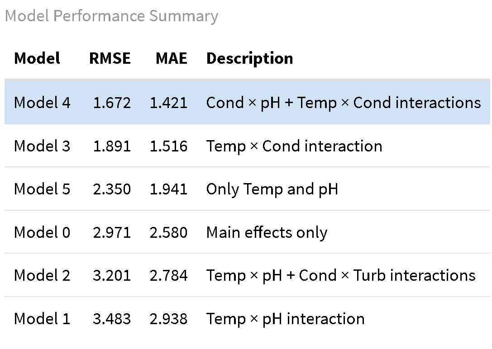

```{r setup, include=FALSE}
knitr::opts_chunk$set(echo = FALSE)
```

```{r, include=F}
# Import required libraries
library(dplyr)
library(tidyr)
library(readr)
library(lubridate)
library(ggplot2)
library(zoo)
library(purrr)
library(knitr)
library(patchwork)
library(tidyverse)
library(tidymodels)
library(rpart.plot)
library(kableExtra)
library(vip)
library(png)
library(grid)
library(parsnip)
library(discrim)
```

```{r}
## Import primary cleaned dataset
df_lag_incdec <- read.csv("RWAR_dosing_lag_incdec.csv") |>
  mutate(Timestamp = ymd(Timestamp))
df_lag_incdec$FeCl_change <- as.factor(df_lag_incdec$FeCl_change)
df_lag_incdec$Polymer_change <- as.factor(df_lag_incdec$Polymer_change)
```


# Introduction

## Background and Motivation

The drinking water treatment process takes water from a river, lake, reservoir, or other source, and purifies it to have it reach drinking water standards. 

There are four primary steps of the water treatment process:  
1. Coagulation - Chemicals ("coagulants") are added to raw water to help contaminants
group together into "floc" particles  
2. Flocculation - The water is then slowly mixed to allow these floc particles to grow  
3. Filtration - These particles are filtered out  
4. Disinfection - Water is disinfected to get rid of biological contaminants  
  
This project will focus on Step 1. These chemical doses are one of the most important
features of the treatment process that an operator can change to improve performance.

Many different factors indicate effective chemical dose performance. Examples could include:

* chemical information about the water such as turbidity, charge, or pH
* information on the size of the particles being formed in the flocculation process (found via running tests on water samples)
* observation of filter performance at the end of the process
* total chemical byproducts produced
* output water quality

The chemical processes that determine treatment process performance are complex
and highly interconnected, therefore all of these factors and more are important
in making effective decisions about chemical dosing.  

***The role of an operator in deciding water treatment plant chemical doses is to
look at a wide array of these factors and make decisions about how to adjust
chemical doses.*** The treatment process and operator role are summarized in the figure below.  


```{r}

img_array = readPNG("Images/treatmentplot2.png")
grid.raster(img_array)

```

Treatment plant conditions can change rapidly, so having tools
that aid in selecting chemical doses in response to changing water quality is 
crucial for operators. These chemicals are one of the primary costs of the treatment 
process, costing millions of dollars per year for a mid-size treatment plant. 
The chemical byproducts produced by excessive coagulant doses also have environmental
impacts. Therefore, this is both a financial problem impacting taxpayers, and an
environmental one.

## Project Purpose
***The goal of this project is to produce a model that serves the role of a 
treatment plant operator.*** This model would provide recommended chemical doses,
based on input water quality characteristics, and how operators have dosed 
chemicals in the past. This could prove a useful tool to operators as a "starting
point" in chemical dosing. They could see a change in water quality, retrieve
the suggested chemical dose from the model, test this dose, and adjust from there
based on other information.

# Data Overview and Cleaning

## Data Overview

The data used for this effort is a timeseries dataset from a Colorado water treatment
plant covering 3 years, from 2018-2020. This treatment plant takes its water from a reservoir, which tends to be a more stable water source than sources such as rivers or industrial supplies. 
  
The available data are as follows:

* Raw Water Data
    + pH
    + Temperature (of the water)
    + Turbidity
    + Suspended Grain Size Information
    + Alkalinity
    + Hardness

* Chemical Dosing Data
    + Coagulant Dose - primary additive (allows for floc particle formation)
    + Cationic Polymer Dose - secondary additive (boosts size of floc particles)

## Data Cleaning

Basic data cleaning was conducted based on visual inspection. Most of the raw water 
data we have available was on a 4-hour time increment. So, we decided to combine and 
average by day for our predictions. This is because the dosing data is only 
available as daily averages, so we needed to match our time resolution.  

Before this averaging, we removed or modified values that were clearly outliers, so
the averages would not be skewed by incorrect data. Reasons for these outliers are
most likely equipment malfunction.  

* **pH**: No significant outliers that we could see, so we simply day-averaged.
* **Temperature**: There was one region of approximately zero temperature (unrealistic
for the reservoir). We got rid of these values and interpolated to the nearest non-zero temperature.
* **Conductivity**: Values less than 0.2 and greater than 2 were removed, since they 
are unreasonable based on this dataset and the "usual" values.
* **Turbidity**: A few exceptionally high values (relative to the usual data values)
were removed before averaging.
* **Grain Size Information**: This data was highly variable, and simply looks like "noise",
so did not seem helpful for prediction. We thus did not clean it.
* **Alkalinity and Hardness**: These data have different time availability than the other
datasets but will be inspected. Removed zero-values.
  
Final Combination: We merged the raw water data (excluding alkalinity/hardness) with the dosing data. We only lost about 10 records in this process, where there was not available 
dosing data for the raw water measurements. 

## Exploratory Analysis

Some of this cleaned data is presented below.

### Alkalinity and Hardness Data

Alkalinity and hardness tend to stay fairly steady over time.

```{r,echo=F}
alk_df <- read_csv("alkalinity_hardness_cleaned.csv",show_col_types = FALSE)
alk_df$Date <- mdy(alk_df$Date)

plot_alk <- ggplot(alk_df, aes(x = Date,
                           y = alkalinity,
                           color = alkalinity)) +
  geom_point() + 
  scale_color_gradient(low = 'blue', high = 'red') +
  theme_minimal() +
  ggtitle("Alkalinity")

plot_hardness <- ggplot(alk_df, aes(x = Date,
                           y = hardness,
                           color = hardness)) +
  geom_point() + 
  scale_color_gradient(low = 'blue', high = 'red') +
  theme_minimal() +
  ggtitle("Hardness")

plot_alk/plot_hardness
```


### Primary Raw Water Characteristic Data

```{r, fig.width=7, fig.height=4}

df_lag_incdec_long <- df_lag_incdec |>
  pivot_longer(
    cols = starts_with("mean_"),
    names_to = "Characteristics",
    values_to = "Value"
  )

ggplot(df_lag_incdec_long, aes(x = Timestamp, y = Value)) +
  geom_point(size = 0.5, color="blue") +
  facet_wrap(~Characteristics, scales = "free_y") +
  theme_minimal() +
  labs(
    x = "Date",
    y = "Value",
    title = "Raw Water Characteristics"
  )

```


### Coagulant Dose Data

```{r, fig.width=7, fig.height=2}

plot_polymer <- ggplot(df_lag_incdec, aes(x = Timestamp,
                           y = Polymer_dose,
                           color = Polymer_dose)) +
  geom_line() + 
  scale_color_gradient(low = 'yellow', high = 'green') +
  theme_minimal() +
  ggtitle("Polymer Coagulant")

print(plot_polymer)

plot_FeCl <- ggplot(df_lag_incdec, aes(x = Timestamp,
                           y = FeCl_dose,
                           color = FeCl_dose)) +
  geom_line() + 
  scale_color_gradient(low = 'blue', high = 'orange') +
  theme_minimal() +
  ggtitle("FeCl Coagulant")

print(plot_FeCl)
```


## Predictor Selection

Based on preliminary analyses, we will focus on the following dose predictors:   
   
- **pH** (strongest relationship)
- **Temperature** (strongest relationship)
- **Conductivity** (some noise, weaker)
- **Turbidity** (lots of noise, weaker)


Overall, it seems like temperature and pH have the strongest 
relationships to chemical dosing. This is consistent with feedback from treatment
plant operators. It is not immediately clear which relationships could
make effective predictors. Turbidity is highly variable and likely does 
not have a strong relationship.

Outcome: **FeCl Dose**. (Polymer dose is not changed significantly in plants.)

## Added Variables

We introduced **lagged variables** like in the Stock dataset from the homework.  
   
To capture time-dependence of this dataset, we will introduce lagged variables. 
For each of the main water parameters, we will introduce two lagged variables, giving
the water characteristics for the day before and two days before.
   
We also introduced a **categorical predictor** indicating whether the dose increased, decreased, or stayed the same compared to the day before.


# Modeling

## Summary of Modeling Efforts

### Modeling Priorities
The main priorities in this modeling effort are *interpretability*, and effective capturing of *nonlinear behavior*. Interpretability is important because to trust a model, a treatment plant operator will want to understand the inner workings of how it is making its predictions. Nonlinear behavior is important because the chemical process involved in the treatment process are highly complex so a simple linear model will likely not capture these chemical relationships effectively. We recognize that these two goals can be at odds, due to the harder-to-interpret nature of highly nonlinear models, so we will attempt to choose models that balance these two objectives.


### Training and Testing Datasets
- Training and Testing
   - Training 2018-2019, Testing 2020
   - Approximately 70/30 split
   
### Models Used
The following models will be used for the two main tasks at hand. Models that work well with numerical outcomes will be used for coagulant dose prediction. Models that are effective for classification will be used for coagulant dose change prediction, since this is a three-category classification problem.  

- **Coagulant Dose Prediction**
   - Linear Regression Models
   - Tree-Based Models
   - Generalized Additive Model
- **Coagulant Dose Change Prediction**
   - LDA and QDA Classification
   - Multinomial Classification
   - Random Forest Classification


## Dose Prediction Models


### Overview of Dose Prediction

```{r}

df_lag_incdec_long <- df_lag_incdec |>
  pivot_longer(
    cols = starts_with("mean_"),
    names_to = "Characteristics",
    values_to = "Value"
  )

ggplot(df_lag_incdec_long, aes(x = Timestamp, y = Value, color = FeCl_dose)) +
  geom_point(size = 0.7) +
  facet_wrap(~Characteristics, scales = "free_y") +
  scale_color_viridis_c(option = "plasma") +
  theme_minimal() +
  labs(
    x = "Date",
    y = "Value",
    color = "Ferric Chloride (mg/L)",
    title = "Water Quality Characteristics Over Time Colored by Dosing"
  )


```

### Linear Regression

**Ethan's section to fill in**

**from presentation:**

- Created 6 models with different predictors and combinations of interaction terms

- Used lag variables for temp, pH, conductivity, turbidity

- Dropped Turbidity as it was not a good predictor for FeCL dosing

- Difficult to determine what factors of the dataset are driving the predictions

- RMSE and MAE vary widely depending which predictors are selected and the interactions

```{r, out.width="80%", out.height="88%"}

```

### Decision Tree
The benefit of a tree-based model in this application is that it is easily interpretable.
It could serve as a decision-making tool for a treatment plant operator:

* The operator sees a change in raw water conditions
* Obtains a recommended dose based on the decision tree
* Easily interprets the "why" of the dosing recommendation by following the logic of the decision tree
* Understands which variables were most important in deciding on a dose


```{r, fig.width=5, fig.height=2.5}
set.seed(445)

# Decision Tree

# For now just predicting numerical amounts, not classifying
data = read.csv("RWAR_dosing_lag_incdec.csv")
data = as.data.frame(data)
data$FeCl_change = NULL
data$Polymer_change = NULL

# Set up training & testing data

# Can change these if you want to modify the tree/data
tree_depth = 5 # tree depth
min_n = 50 # minimum observations needed to further split

train_data = data %>%
  filter(year(Timestamp) <= 2019)
test_data = data %>%
  filter(year(Timestamp) >= 2020)

# Create the tree

recipe = recipe(FeCl_dose ~ ., data = train_data) %>% # Change target variable here
  step_rm(Timestamp) %>%
  step_rm(Polymer_dose) # Remove the other target variable here

tree_spec = decision_tree(tree_depth = tree_depth, min_n = min_n) %>%
  set_engine("rpart") %>%
  set_mode("regression")

workflow = workflow() %>%
  add_recipe(recipe) %>%
  add_model(tree_spec)

fit_tree = workflow %>%
  fit(data = train_data)

# Plot the tree

fit_tree %>%
  extract_fit_engine() %>%
  rpart.plot(roundint = FALSE)

# Assess accuracy

predictions = fit_tree %>%
  predict(test_data) %>%
  bind_cols(test_data)

actual = predictions$`FeCl_dose` # Change target variable here
predicted = predictions$.pred

rmse = sqrt(mean((actual - predicted)^2))
r_squared = cor(actual, predicted)^2
mae = mean(abs(actual-predicted))

metrics = data.frame(
  Metric = c("RMSE", "R-Squared", "MAE"),
  Value  = c(rmse, r_squared, mae)
)

kable(metrics, booktabs = TRUE, digits = 3) %>%
  kable_styling(position = "center", font_size = 12)

```

### Random Forest

Random forest was used was the logical next step to try to better capture the nonlinear patterns in our data. Multiple different tree amounts were attempted, but ultimately they all performed similarly. Although the random forest was unable to model the data, we were able to determine which features had the most importance. A graph was created to visualize the feature importance for this dataset. Notably, pH and the pH lag variables were the most important. Temperature and the temperature lag variables followed, which is similar to what we concluded from other models and our exploratory analysis.

```{r, fig.width=5, fig.height=2.1}
set.seed(445)

# Random Forest

# For now just predicting numerical amounts, not classifying
data = read.csv("RWAR_dosing_lag_incdec.csv")
data = as.data.frame(data)
data$FeCl_change = NULL
data$Polymer_change = NULL

# Set up training & testing data

# Can change these if you want to modify the tree/data
trees = 500 # number of trees in the forest
min_n = 50 # minimum observations needed to further split

train_data = data %>%
  filter(year(Timestamp) <= 2019)
test_data = data %>%
  filter(year(Timestamp) >= 2020)

# Create the tree

recipe = recipe(FeCl_dose ~ ., data = train_data) %>% # Change target variable here
  step_rm(Timestamp) %>%
  step_rm(Polymer_dose) # Remove the other target variable here

rf_spec = rand_forest(trees = trees, min_n = min_n) %>%
  set_engine("ranger", importance = "impurity") %>%
  set_mode("regression")

workflow = workflow() %>%
  add_recipe(recipe) %>%
  add_model(rf_spec)

fit_rf = workflow %>%
  fit(data = train_data)

# Assess accuracy

predictions = fit_rf %>%
  predict(test_data) %>%
  bind_cols(test_data)

actual = predictions$`FeCl_dose` # Change target variable here
predicted = predictions$.pred

# Metrics and plots

model_metrics = predictions %>%
  metrics(truth = FeCl_dose, estimate = .pred) # Change target variable here
rmse = model_metrics$.estimate[1]
r_squared = model_metrics$.estimate[2]
mae = model_metrics$.estimate[3]

metrics = data.frame(
  Metric = c("RMSE", "R-Squared", "MAE"),
  Value  = c(rmse, r_squared, mae)
)

vip(fit_rf, num_features = 20) +
  geom_col(color = "black", fill = "coral") +
  labs(
    title = "Feature Importance (Random Forest)",
    x = "Importance",
    y = "Feature"
  ) +
  theme_minimal(base_size = 9)

kable(metrics, booktabs = TRUE, digits = 3) %>%
  kable_styling(position = "center", font_size = 12)

```


### Generalized Additive Model (GAM)

**Josh's section to insert his GAM**

### Summary of Dose Prediction Models

```{r, fig.height=3.8, fig.width=7}

# - The model with pH & temperature interactions with conductivity performed the best out of models tested.
# - Tree-based models performed the worst, likely due to overfitting.
# - All models diverged from the actual dose by an average of at least 1.4 mg/L.

dosepred_df <- data.frame(Model = c("Random Forest", "Decision Tree", "Cond-pH + Cond-Temp", "Conductivity-Temp", "Temp and pH"),
                          RMSE = c(2.811, 2.756, 1.672, 1.891, 2.350),
                          MAE = c(2.283, 2.484, 1.421, 1.516, 1.941))

# convert to long format
dosepred_long <- dosepred_df |>
  arrange(RMSE) |>
  mutate(Model = factor(Model, levels = unique(Model))) |>
  pivot_longer(
    cols = c(RMSE, MAE),
    names_to = "Metric",
    values_to = "Value"
  )

# Plot generation
ggplot(dosepred_long, aes(x = Model, y = Value, fill = Metric)) +
  geom_bar(stat = "identity", position = position_dodge(width = 0.8), width = 0.7) +
  geom_text(
    aes(label = sprintf("%.3f", Value)), 
    position = position_dodge(width = 0.8),
    vjust = -0.5, 
    size = 2
  ) +
  labs(
    title = "Dose Prediction Model Comparison (RMSE and MAE)",
    x = "Model",
    y = "Error Value"
  ) +
  theme_minimal() +
  theme(axis.text.x = element_text(angle = 60, hjust = 1))
```

## Dose Change Prediction Models


### Overview of Dose Change Prediction

The goal of dose change prediction models is to predict whether coagulant dose increased, decreased, or stayed the same based on raw water characteristics.
  
As mentioned previously, we added two variables called `FeCl_change` and `Polymer_change` that indicate the chemical dose's direction of change.
  
This will allow classification methods to be applied. Additionally, if effective,
this could provide a more helpful tool for operators. Instead of attempting to 
predict a specific dose, it could give a general direction for an operator to 
attempt a dose change. This is how plants work in practice: an operator uses 
some tool (a water test, a reading from a device, etc.), and uses that to make 
a dose change. They then check important treatment metrics and make any needed
further adjustments.  
  
The following is a helpful visualization of how dose change varies over time with each of the key raw water characteristics.

```{r, fig.width=7, fig.height=3}

ggplot(df_lag_incdec_long, aes(x = Timestamp, y = Value, color = FeCl_change)) +
  geom_point(size = 0.7) +
  facet_wrap(~Characteristics, scales = "free_y") +
  theme_minimal() +
  labs(
    x = "Date",
    y = "Value",
    color = "FeCl_change",
    shape = "FeCl_change",
    title = "Raw Water Characteristics Colored by Dose Change"
  )

```


Based on this plot, [in essence, we're screwed, but say it diplomatically]

### LDA

- Experimented with predictor sets and found that pH and temperature (plus the associated lagged variables) were the main effective predictors.
- Turbidity and conductivity did not improve prediction.  
  
LDA ACCURACY: 43.7%
  
  
```{r}
set.seed(445)

## TRAIN/TEST DATA (2018-2019 and 2020)
df_full <- df_lag_incdec |> select(-c(FeCl_dose, Polymer_dose))
df_train <- df_full |> filter(year(Timestamp) <= 2019)
df_test  <- df_full |> filter(year(Timestamp) == 2020)

## LDA
lda_spec <- discrim_linear()
lda_fit1 <- lda_spec |>
  fit(FeCl_change ~ ., data = df_train |> 
        select(-c(Polymer_change, Timestamp)))
lda_fit2 <- lda_spec |>
  fit(FeCl_change ~ mean_pH + mean_Temp + pH_lag1 + pH_lag2 + Temp_lag1 + Temp_lag2, data = df_train)

# select LDA to take metrics of
lda_fit <- lda_fit2

# performance metrics
lda_fit_disp <- lda_fit |> extract_fit_engine()
lda_conf <- lda_fit |> 
  augment(new_data = df_test) |>
  conf_mat(truth = FeCl_change, estimate = .pred_class)
lda_acc <- lda_fit |>
  augment(new_data = df_test) |>
  accuracy(truth = FeCl_change, estimate = .pred_class)

lda_table <- lda_conf$table |> 
  as.data.frame() |>
  rename(Predicted = Prediction, True = Truth, Count = Freq)
lda_table |>
  tidyr::pivot_wider(names_from = Predicted, values_from = Count) |>
  knitr::kable("markdown", caption = "LDA Confusion Matrix")

## Notes
# 39% test accuracy on all predictors
# 41% test accuracy on temp and pH

```


### QDA

- Experimented with predictor sets and found that pH and temperature (plus the associated lagged variables) were the main effective predictors.
- Turbidity and conductivity did not improve prediction.  
  
QDA ACCURACY: 35.7%


```{r}
set.seed(445)

## QDA
qda_spec <- discrim_quad()
qda_fit1 <- qda_spec |>
  fit(FeCl_change ~ ., data = df_train |> 
        select(-c(Polymer_change, Timestamp)))
qda_fit2 <- qda_spec |>
  fit(FeCl_change ~ mean_pH + mean_Temp + pH_lag1 + pH_lag2 + Temp_lag1 + Temp_lag2, data = df_train)

# select QDA to take metrics of
qda_fit <- qda_fit2

# performance metrics
qda_fit_disp <- qda_fit |> extract_fit_engine()
qda_conf <- qda_fit |> 
  augment(new_data = df_test) |>
  conf_mat(truth = FeCl_change, estimate = .pred_class)
qda_acc <- qda_fit |>
  augment(new_data = df_test) |>
  accuracy(truth = FeCl_change, estimate = .pred_class)

qda_table <- qda_conf$table |> 
  as.data.frame() |>
  rename(Predicted = Prediction, True = Truth, Count = Freq)
qda_table |>
  tidyr::pivot_wider(names_from = Predicted, values_from = Count) |>
  knitr::kable("markdown", caption = "QDA Confusion Matrix")

## Notes
# 39.5% test accuracy on all predictors
# 43.7% test accuracy on temp and pH

```


### Multinomial Classification

- Experimented with predictor sets and found that pH and temperature (plus the associated lagged variables) were the main effective predictors.
- Turbidity and conductivity did not improve prediction.  
  
MULTINOMIAL ACCURACY: 46.3%


```{r}
## MULTINOMIAL REGRESSION
multi_model <- multinom_reg() |>
  set_engine("nnet") |>
  set_mode("classification")

multi_recipe1 <- recipe(FeCl_change ~ mean_Temp + Temp_lag1 + Temp_lag2 + mean_pH + pH_lag1 + pH_lag2 + mean_Conductivity + Cond_lag1 + Cond_lag2, data = df_train) |>
  step_normalize(all_numeric_predictors()) |>
  step_dummy(all_nominal_predictors())

multi_recipe <- multi_recipe1

multi_workflow <- workflow() |>
  add_recipe(multi_recipe) |>
  add_model(multi_model)

multi_fit <- fit(multi_workflow, data = df_train)

df_pred_class <- predict(multi_fit, new_data = df_test, type = "class") |>
  bind_cols(df_test |> select(FeCl_change))
df_pred_probs <- predict(multi_fit, new_data = df_test, type = "prob") |>
  bind_cols(df_test |> select(FeCl_change))

# results
multi_acc <- metrics(df_pred_class, truth = FeCl_change, estimate = .pred_class) |> 
  filter(.metric == "accuracy")
multi_conf <- conf_mat(df_pred_class, truth = FeCl_change, estimate = .pred_class)
multi_fit_disp <- multi_fit |> extract_fit_engine()

multi_table <- multi_conf$table |> 
  as.data.frame() |>
  rename(Predicted = Prediction, True = Truth, Count = Freq)
multi_table |>
  tidyr::pivot_wider(names_from = Predicted, values_from = Count) |>
  knitr::kable("markdown", caption = "Multinomial Regression Confusion Matrix")

## NOTES
# turbidity is highly variable and does not help

```


### Random Forest

- Experimented with predictor sets and found that pH and temperature (plus the associated lagged variables) were the main effective predictors.
- Turbidity and conductivity did not improve prediction.  
  
RANDOM FOREST ACCURACY: 39.2%


```{r}

set.seed(445)

## RANDOM FOREST
rf_spec <- rand_forest(mtry = sqrt(.cols()), trees=500, min_n=1) |>
  set_engine("randomForest", importance = TRUE) |>
  set_mode("classification")

# Different model fits
rf_fit1 <- rf_spec |>
  fit(FeCl_change ~ ., data = df_train |> 
        select(-c(Polymer_change, Timestamp)))
rf_fit2 <- rf_spec |>
  fit(FeCl_change ~ mean_Temp + mean_pH + Temp_lag1 + Temp_lag2 + pH_lag1 + pH_lag2, 
      data = df_train)
rf_fit3 <- rf_spec |>
  fit(FeCl_change ~ mean_pH + mean_Temp, 
      data = df_train)

# Model fit to take performance metrics of:
rf_fit <- rf_fit2

# Most important predictors
#vip(rf_fit)

## results
rf_acc <- rf_fit |>
  augment(new_data = df_test) |>
  accuracy(truth = FeCl_change, estimate = .pred_class)
rf_conf <- rf_fit |>
  augment(new_data = df_test) |>
  conf_mat(truth = FeCl_change, estimate = .pred_class)

rf_table <- rf_conf$table |> 
  as.data.frame() |>
  rename(Predicted = Prediction, True = Truth, Count = Freq)
rf_table |>
  tidyr::pivot_wider(names_from = Predicted, values_from = Count) |>
  knitr::kable("markdown", caption = "Random Forest Confusion Matrix")

## Notes
# 34% accuracy for all predictors
# 39% accuracy for temp + pH + temp/pH lags
# 46.6% accuracy for just temperature and pH

```


### Summary of Dose Change Prediction Models

Overall ineffective, and prone to overfitting (especially random forest).  
Model predicting no dose change would be more accurate.  

```{r, fig.width=7, fig.height=3}

dosechangepred_df <- data.frame(
  Model = c("LDA", "QDA", "Multinomial", "Random Forest"),
  Accuracy = c(lda_acc$.estimate, qda_acc$.estimate, 
               multi_acc$.estimate, rf_acc$.estimate)
) |> arrange(Accuracy)

ggplot(dosechangepred_df, aes(x = reorder(Model,-Accuracy), y = Accuracy)) +
  geom_col(fill = "steelblue") +
  geom_text(aes(label = scales::percent(Accuracy, accuracy = 0.1)),
            vjust = -0.3, size = 4) +
  scale_y_continuous(labels = scales::percent_format(accuracy = 1),
                     limits = c(0, max(dosechangepred_df$Accuracy) * 1.1)) +
  labs(x = "Model", y = "Accuracy") +
  theme_minimal()

```

# Overview of Model Results

(talk about how the models compared, more just synthesizing than making commentary. save commentary for conclusion)

# Conclusion

- Predicting chemical doses based on these raw water characteristics proved to be ineffective
- Most likely reasons:
   - Limited size of dataset
   - Limited predictor set
   - Operator-dependent
   - Complexity of chemical relationships
   - Other factors (example: reservoir turnover)
- Operators make decisions based on variety of other factors: chemical waste production, filter performance, lab tests, etc.
- Incorporate more varieties and time ranges of data in future modeling efforts

