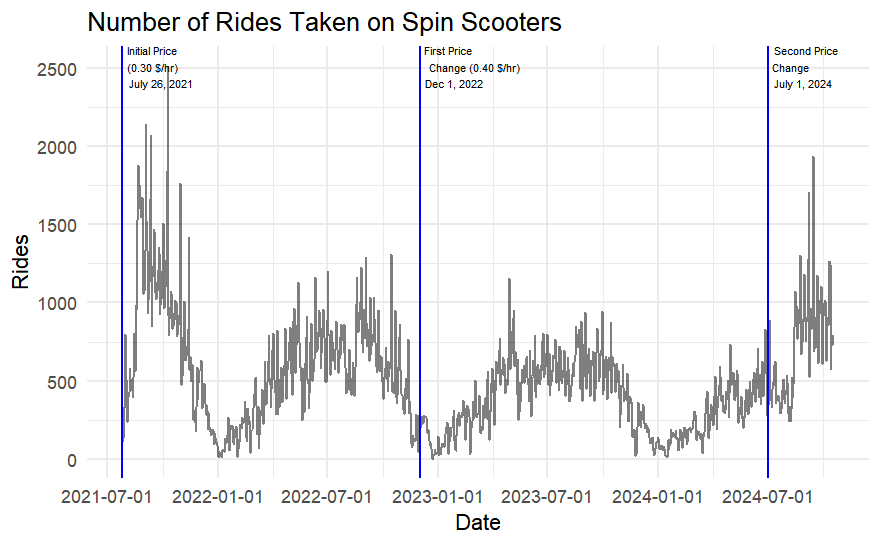
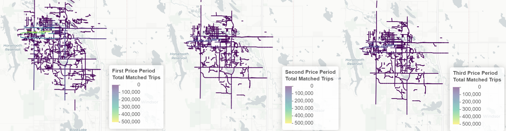

## Spin E-Scooters

## Research Question

Grace's Research Question

-   Emily's Research Question

-   Nick's Research Question

## Examining the Data

::: r-fit-text
Our data was provided for by three different sources, and as such, there were a lot of different formats for the data we worked with and options for the project

-   Fort Collins Transportation Planner

    -   fort-collins-curb-events-deployments.csv

    -   fort-collins-curb-events-trip_starts.csv

    -   fort-collins-curb-events-trip_ends.csv

-   City of Fort Collins Website

    -   scooters-analyze-trips-by-date.csv

    -   fortcollins-routs-data-for-scooter-in-all-time.csv

    -   fortcollins-metrics-data-for-scooter-csv

-   Head of Government Partnership at Spin
:::

## \<Exploratory Analysis\>

{width="217"}

\*Add more basic graphs to help readers understand our data yk\*

## Weekly Models

## Weekly Forecasting

## Monthly Models

## Monthly Forecasting

## Predicting Future Rides without Price Period 3

The data for the actual number of rides ends October 17th 2024, so there isn't a lot to compare.

## Matched Rides Per Price Period

The graphs contain normalized data of roads/line segments in Fort Collins and the count of matched trips taken over that price period.

Wanted to examine this further, but ran into problems.

## \<Nick's Prediction Slides\>

## \<Conclusion Slide\>

\*Can just wrap this up nicely, with this price here's how we predict spin's market to react\*
